# Diagrama Entidad-Relación — GuideFlow

```mermaid
erDiagram
    GUIDE ||--o{ ACTIVITY : creates
    GUIDE {
        uuid id PK
        string email UK
        string name
        string slug UK
        string phone
        string bio
        string avatar_url
        string zone
        string stripe_account_id
        enum stripe_status
        enum plan
        timestamp created_at
    }

    ACTIVITY ||--o{ TIME_SLOT : has
    ACTIVITY {
        uuid id PK
        uuid guide_id FK
        string title
        text description
        int price_cents
        int duration_minutes
        int max_participants
        boolean weather_dependent
        boolean active
        text[] photos
        timestamp created_at
    }

    TIME_SLOT ||--o{ BOOKING : receives
    TIME_SLOT {
        uuid id PK
        uuid activity_id FK
        date date
        time start_time
        int spots_remaining
        enum status
        timestamp created_at
    }

    BOOKING ||--|| PAYMENT : has
    BOOKING {
        uuid id PK
        uuid time_slot_id FK
        uuid guide_id FK
        string customer_name
        string customer_email
        string customer_phone
        int num_people
        text notes
        enum status
        timestamp created_at
    }

    PAYMENT {
        uuid id PK
        uuid booking_id FK
        string stripe_payment_id
        int amount_cents
        int platform_fee_cents
        enum status
        timestamp created_at
    }
```

## Consultas más frecuentes

| Consulta | Frecuencia | Índice necesario |
|----------|-----------|-----------------|
| Slots disponibles por actividad y fecha | Muy alta | `(activity_id, date, status)` |
| Bookings por guía y mes | Alta | `(guide_id, created_at)` |
| Guía por slug (microsite) | Alta | `(slug)` UNIQUE |
| Actividades activas de un guía | Alta | `(guide_id, active)` |

## Borrado lógico vs físico

- **Bookings:** Borrado lógico (cambia `status` a `cancelled`)
- **Guías:** Borrado lógico (campo `deleted_at`)
- **Actividades:** Borrado lógico (`active = false`)
- **Pagos:** NUNCA se borran (auditoría legal)

---

## 🔍 Preguntas de Revisión

- [ ] ¿Qué consultas SQL vamos a hacer más frecuentemente? ¿Están optimizadas?
- [ ] ¿Hay campos que podrían crecer indefinidamente? (texto, etc.)
- [ ] ¿Cómo manejamos la eliminación de datos? ¿Borrado físico o lógico?
- [ ] ¿Qué índices hemos definido y por qué?
- [ ] ¿La estructura soporta que un guía tenga múltiples servicios y precios?

## 🔒 Preguntas de Aislamiento de Datos

- [ ] ¿Implementamos RLS (Row Level Security) en PostgreSQL?
- [ ] ¿Podemos garantizar que un guía con SQL injection no pueda ver datos de otros?
- [ ] ¿Cómo evitamos que un guía vea reservas de otro modificando el ID en la URL?
- [ ] ¿Qué pasa si un empleado de soporte necesita ver datos de un guía? ¿Cómo auditamos?
- [ ] ¿Hay datos sensibles (emails, teléfonos) que deberían estar cifrados en reposo?
- [ ] ¿Cómo gestionamos la anonimización de datos para pruebas/desarrollo?
- [ ] Si un guía abandona la plataforma, ¿cuánto tardamos en borrar TODOS sus datos?

## 🧪 Preguntas de Auditoría y Trazabilidad

- [ ] ¿Guardamos un log de QUIÉN hizo QUÉ y CUÁNDO? (tabla de auditoría)
- [ ] ¿Podemos reconstruir el estado de una reserva en cualquier momento del pasado?
- [ ] ¿Cómo sabemos si alguien (empleado o externo) accedió a datos sensibles?
- [ ] ¿Los logs de auditoría son inmutables? (no se pueden borrar ni modificar)
- [ ] ¿Durante cuánto tiempo guardamos logs?
- [ ] ¿Qué eventos son auditables? (login, cambios de reserva, pagos, borrado)
- [ ] ¿Cómo protegemos los logs de auditoría contra accesos no autorizados?
